# Icon System Documentation (Archived)

**Status:** Archived — superseded by the tabletop SVG/card/piece system

**Design Philosophy:** Medieval Illuminated Manuscript
**Source:** [game-icons.net](https://game-icons.net/)
**Implementation Date:** 2025-12-01

---

## Overview

Custom SVG icon system for Settlers of Catan: Cities & Knights with color-coded theming inspired by medieval illuminated manuscripts and heraldic crests.

### Key Features
- **Color-coded by category** - Resources (earthy), Commodities (refined), Knights (metal hierarchy)
- **Dynamic SVG coloring** - Icons change color based on context (player ownership, active state)
- **Performance optimized** - SVG caching, minimal re-renders
- **Accessible** - Proper alt text, ARIA labels

---

## Color Palette

### Resources (Natural & Earthy)
```javascript
wood:  '#8B4513'  // Saddle brown
brick: '#A0522D'  // Sienna (terracotta clay)
sheep: '#F5F5DC'  // Beige (wool)
wheat: '#DAA520'  // Goldenrod
ore:   '#708090'  // Slate gray (stone)
```

### Commodities (Refined & Valuable)
```javascript
paper: '#9B59B6'  // Rich purple (royal manuscripts)
cloth: '#C0392B'  // Deep crimson (dyed fabric)
coin:  '#FFD700'  // Pure gold
```

### Knights (Martial Progression)
```javascript
basic:  '#CD7F32'  // Bronze (basic helm)
strong: '#C0C0C0'  // Silver (flanged mace)
mighty: '#FFD700'  // Gold (crowned skull)
```

### City Improvements (Category Colors)
```javascript
science:  '#16a34a'  // Green-600 (alchemy/nature)
trade:    '#f59e0b'  // Amber-500 (commerce/gold)
politics: '#3b82f6'  // Blue-500 (royal authority)
```

### Special Pieces
```javascript
robber:          '#1a1a1a'  // Near black (menacing)
merchant:        '#16a34a'  // Green (trade)
barbarian-ship:  '#7f1d1d'  // Dark red-900 (danger)
dice:            '#1e293b'  // Slate-900 (neutral)
```

---

## Icon Catalog

### Resources (5 icons)

| Icon | Type | Source | Color | Usage |
|------|------|--------|-------|-------|
| `wood-pile.svg` (asset not retained) | `wood` | [wood-pile](https://game-icons.net/1x1/lorc/wood-pile.html) | Saddle brown | PlayerHand, BuildControls |
| 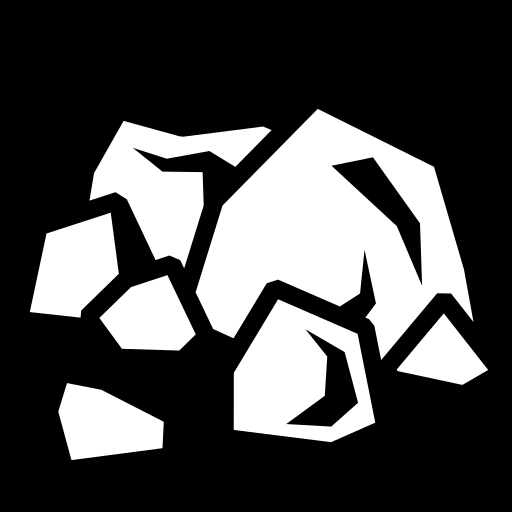 | `brick` | [stone-pile](https://game-icons.net/1x1/delapouite/stone-pile.html) | Sienna | PlayerHand, BuildControls |
| 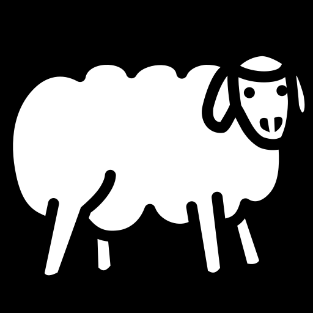 | `sheep` | [sheep](https://game-icons.net/1x1/delapouite/sheep.html) | Beige | PlayerHand, BuildControls |
| 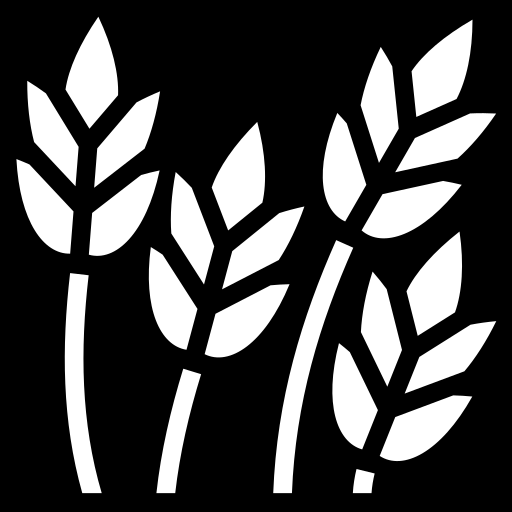 | `wheat` | [wheat](https://game-icons.net/1x1/lorc/wheat.html) | Goldenrod | PlayerHand, BuildControls |
| `ore.svg` (asset not retained) | `ore` | [stone-block](https://game-icons.net/1x1/lorc/stone-block.html) | Slate gray | PlayerHand, BuildControls |

### Commodities (3 icons)

| Icon | Type | Source | Color | Usage |
|------|------|--------|-------|-------|
| `paper.svg` (asset not retained) | `paper` | [scroll-unfurled](https://game-icons.net/1x1/lorc/scroll-unfurled.html) | Rich purple | PlayerHand, C&K mode |
|  | `cloth` | [spool](https://game-icons.net/1x1/lorc/spool.html) | Deep crimson | PlayerHand, C&K mode |
| 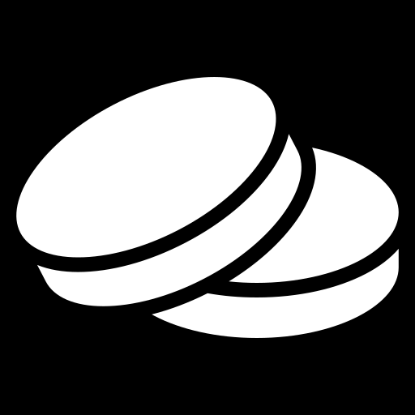 | `coin` | [two-coins](https://game-icons.net/1x1/lorc/two-coins.html) | Gold | PlayerHand, C&K mode |

### Structures (5 icons)

| Icon | Type | Source | Color | Usage |
|------|------|--------|-------|-------|
| `settlement.svg` (asset not retained) | `settlement` | [wooden-sign](https://game-icons.net/1x1/delapouite/wooden-sign.html) | Player color | BuildControls, Board |
| 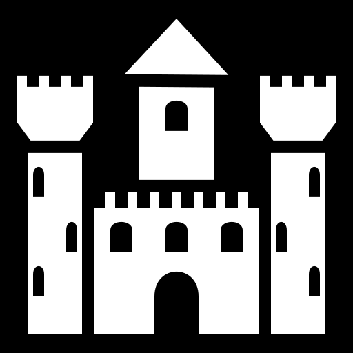 | `city` | [castle](https://game-icons.net/1x1/delapouite/castle.html) | Player color | BuildControls, Board |
| 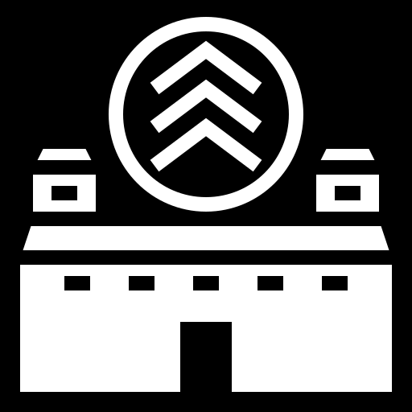 | `metropolis` | [citadel](https://game-icons.net/1x1/lorc/citadel.html) | Player color | Board (C&K) |
| 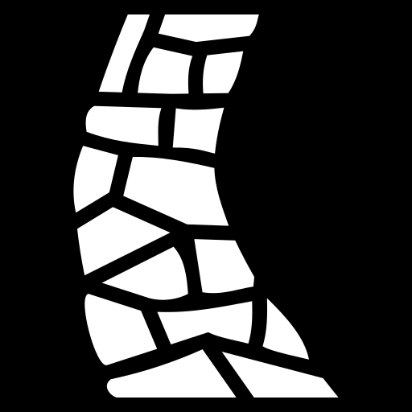 | `road` | [stone-path](https://game-icons.net/1x1/lorc/stone-path.html) | Player color | BuildControls, Board |
| 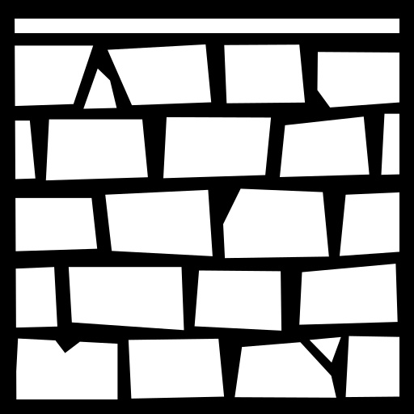 | `city-wall` | [stone-wall](https://game-icons.net/1x1/lorc/stone-wall.html) | Player color | BuildControls, Board (C&K) |

### Knights (3 tiers)

| Icon | Type | Source | Color | Usage |
|------|------|--------|-------|-------|
| 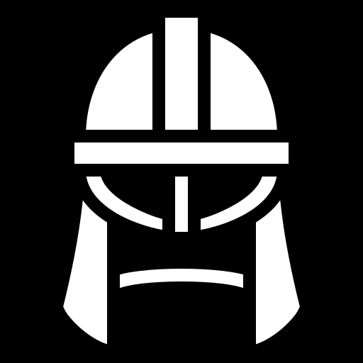 | `basic` | [light-helm](https://game-icons.net/1x1/delapouite/light-helm.html) | Bronze | BuildControls, Board |
| `knight-strong.svg` (asset not retained) | `strong` | [flanged-mace](https://game-icons.net/1x1/lorc/flanged-mace.html) | Silver | Board (C&K) |
| `knight-mighty.svg` (asset not retained) | `mighty` | [crowned-skull](https://game-icons.net/1x1/lorc/crowned-skull.html) | Gold | Board (C&K) |

### City Improvements (3 tracks)

| Icon | Type | Source | Color | Usage |
|------|------|--------|-------|-------|
| 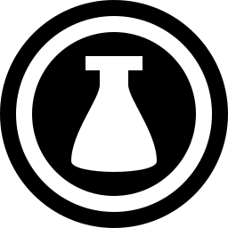 | `science` | [beaker](https://game-icons.net/1x1/lorc/beaker.html) | Green-600 | GameStatus, Progress Cards |
| 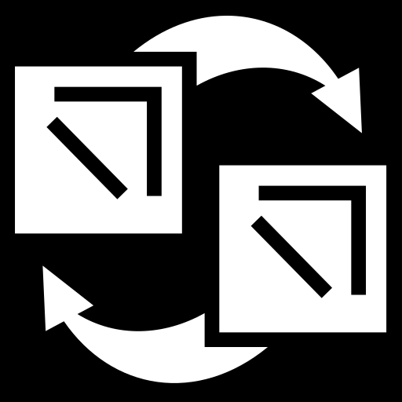 | `trade` | [gold-bar](https://game-icons.net/1x1/delapouite/gold-bar.html) | Amber-500 | GameStatus, Progress Cards |
| `politics.svg` (asset not retained) | `politics` | [crown](https://game-icons.net/1x1/lorc/crown.html) | Blue-500 | GameStatus, Progress Cards |

### Special Pieces (4 icons)

| Icon | Type | Source | Color | Usage |
|------|------|--------|-------|-------|
| 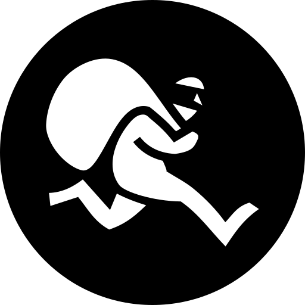 | `robber` | [masked-spider](https://game-icons.net/1x1/lorc/masked-spider.html) | Near black | Board |
| `merchant.svg` (asset not retained) | `merchant` | [trade](https://game-icons.net/1x1/lorc/trade.html) | Green | Board (C&K) |
| `barbarian-ship.svg` (asset not retained) | `barbarian-ship` | [galleon](https://game-icons.net/1x1/lorc/galleon.html) | Dark red | Barbarian Track |
| `dice.svg` (asset not retained) | `dice` | [dice-six](https://game-icons.net/1x1/skoll/perspective-dice-six-faces-random.html) | Slate-900 | DiceDisplay, BuildControls |

---

## Component API

### GameIcon (Base Component)

```tsx
import { GameIcon } from '@/components/ui/icons/GameIcon';

<GameIcon
  type="wood"              // Icon type
  size={24}                // Size in pixels (default: 24)
  className="..."          // Additional CSS classes
  playerColor="#FF0000"    // For structures (overrides base color)
  active={true}            // For knights (inactive = reduced opacity)
  style={{}}               // Additional inline styles
/>
```

### ResourceIcon

```tsx
import { ResourceIcon } from '@/components/ui/icons/GameIcon';

<ResourceIcon
  type="wood"              // 'wood' | 'brick' | 'sheep' | 'wheat' | 'ore'
  size={20}                // Default: 20
  count={5}                // Optional count to display
  showCount={true}         // Show count next to icon
  className="..."
/>
```

**Example:**
```tsx
<ResourceIcon type="wheat" size={22} count={3} showCount />
// Renders: [wheat icon] 3
```

### CommodityIcon

```tsx
import { CommodityIcon } from '@/components/ui/icons/GameIcon';

<CommodityIcon
  type="paper"             // 'paper' | 'cloth' | 'coin'
  size={20}
  count={2}
  showCount={true}
  className="..."
/>
```

### KnightIcon

```tsx
import { KnightIcon } from '@/components/ui/icons/GameIcon';

<KnightIcon
  level="strong"           // 'basic' | 'strong' | 'mighty'
  size={24}
  active={true}            // false = grayed out
  playerColor="#0000FF"    // Optional player color
  className="..."
/>
```

**Active vs Inactive:**
- Active: Full opacity, golden glow effect
- Inactive: 40% opacity, red strikethrough (diagonal line)

### StructureIcon

```tsx
import { StructureIcon } from '@/components/ui/icons/GameIcon';

<StructureIcon
  type="settlement"        // 'settlement' | 'city' | 'metropolis' | 'road' | 'city-wall'
  size={24}
  playerColor="#FF0000"    // REQUIRED - player's color
  className="..."
/>
```

### ImprovementIcon (with Progress Bar)

```tsx
import { ImprovementIcon } from '@/components/ui/icons/GameIcon';

<ImprovementIcon
  type="science"           // 'science' | 'trade' | 'politics'
  level={3}                // Current level
  maxLevel={5}             // Max level (default: 5)
  size={20}
  className="..."
/>
```

**Renders:**
```
[beaker icon] ███████░░░ 3/5
```

---

## Implementation Examples

### PlayerHand (Resources & Commodities)

```tsx
// Before (emoji)
<div className="text-xl">🌲</div>
<div className="font-bold">{player.resources.wood}</div>

// After (colored SVG)
<ResourceIcon type="wood" size={22} />
<div className="font-mono font-bold tabular-nums">{player.resources.wood}</div>
```

### BuildControls (Build Buttons)

```tsx
// Road Button
<button>
  <div className="flex items-center gap-1.5">
    <GameIcon type="road" size={18} playerColor={buildMode === 'road' ? '#fff' : '#94a3b8'} />
    <span>Road ({player.roadsRemaining})</span>
  </div>
  <div className="flex items-center gap-1 text-xs mt-1">
    <GameIcon type="brick" size={14} />
    <span>1</span>
    <GameIcon type="wood" size={14} />
    <span>1</span>
  </div>
</button>
```

### GameStatus (Improvement Tracks)

```tsx
<ImprovementIcon
  type="science"
  level={player.improvements?.science || 0}
  size={16}
  className="flex-1"
/>
{player.metropolisOwned?.includes('science') && (
  <span className="text-xs">🏛️</span>
)}
```

---

## Technical Details

### ColoredSvgIcon Component

Internal component that handles SVG loading, caching, and coloring.

**How it works:**
1. Fetches SVG file from `/public/icons/`
2. Caches SVG content in memory (Map)
3. Replaces `fill` and `stroke` attributes with specified color
4. Renders as inline SVG with proper dimensions

**Performance:**
- SVGs cached after first load
- No re-fetching on re-renders
- Placeholder shown during load (subtle pulse animation)

### File Structure

```
public/icons/
├── wood-pile.svg         (1.7kb)
├── stone-pile.svg        (1.3kb)
├── sheep.svg             (2.5kb)
├── wheat.svg             (3.0kb)
├── ore.svg               (0.6kb)
├── paper.svg             (1.9kb)
├── cloth.svg             (1.7kb)
├── coin.svg              (1.7kb)
├── settlement.svg        (1.7kb)
├── city.svg              (1.1kb)
├── metropolis.svg        (1.7kb)
├── road.svg              (1.7kb)
├── city-wall.svg         (1.7kb)
├── knight-basic.svg      (1.2kb)
├── knight-strong.svg     (1.7kb)
├── knight-mighty.svg     (1.9kb)
├── science.svg           (1.7kb)
├── trade.svg             (1.7kb)
├── politics.svg          (1.6kb)
├── robber.svg            (1.8kb)
├── merchant.svg          (0.8kb)
├── barbarian-ship.svg    (0.8kb)
└── dice.svg              (1.7kb)

Total: ~39kb (uncompressed)
```

### Browser Compatibility

- **Modern browsers:** Full support (Chrome 90+, Firefox 88+, Safari 14+, Edge 90+)
- **SVG:** All icons are pure SVG paths
- **Color manipulation:** CSS filter fallback for older browsers
- **Drop shadow:** CSS `filter: drop-shadow()` for depth

---

## Future Enhancements

### Potential Additions
1. **Hex terrain icons** - Mountain, Forest, Field, Hill, Pasture, Desert
2. **Harbor icons** - 3:1 General, 2:1 specific resources
3. **Event die faces** - Ship, Green, Yellow, Blue with proper graphics
4. **Development cards** - Knight, Road Building, Year of Plenty, Monopoly, VP
5. **Animated icons** - Dice roll, knight activation, resource gain

### Optimization Opportunities
1. **SVG sprite sheet** - Combine all icons into single file with `<symbol>` tags
2. **WebP fallbacks** - For browsers without SVG support (rare)
3. **Lazy loading** - Load icons only when needed
4. **Color variants** - Pre-generate common color variations

---

## Credits

All icons sourced from [game-icons.net](https://game-icons.net/):
- **lorc** - wood-pile, wheat, stone-block, scroll-unfurled, spool, two-coins, flanged-mace, crowned-skull, citadel, stone-path, stone-wall, beaker, crown, masked-spider, trade, galleon
- **delapouite** - stone-pile, sheep, wooden-sign, castle, light-helm, gold-bar
- **skoll** - perspective-dice-six-faces-random

**License:** CC BY 3.0 (Creative Commons Attribution)
**Attribution:** Icons by [Lorc](https://lorcblog.blogspot.com/) and [Delapouite](https://delapouite.com/) under CC BY 3.0

---

## Usage Guidelines

### Do's ✓
- Use consistent sizing across similar contexts (e.g., all resource icons in PlayerHand are 22px)
- Apply player colors to structures to show ownership
- Use `tabular-nums` font class for resource counts (monospace alignment)
- Add tooltips for complex icons (knights, improvements)

### Don'ts ✗
- Don't mix emoji and SVG icons in the same context
- Don't use icons smaller than 12px (readability issues)
- Don't override icon colors arbitrarily (breaks color-coding system)
- Don't animate icons excessively (distracting)

---

**Last Updated:** 2025-12-01
**Maintainer:** Claude Code
**Documentation Version:** 1.0.0
